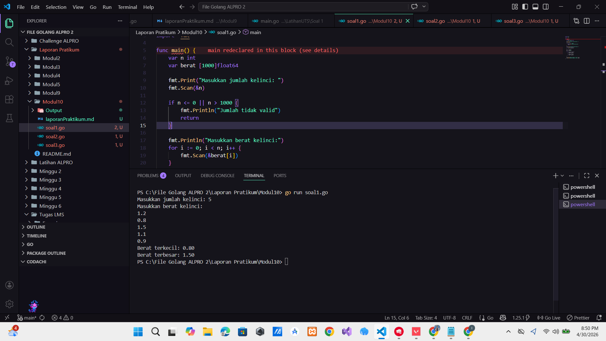
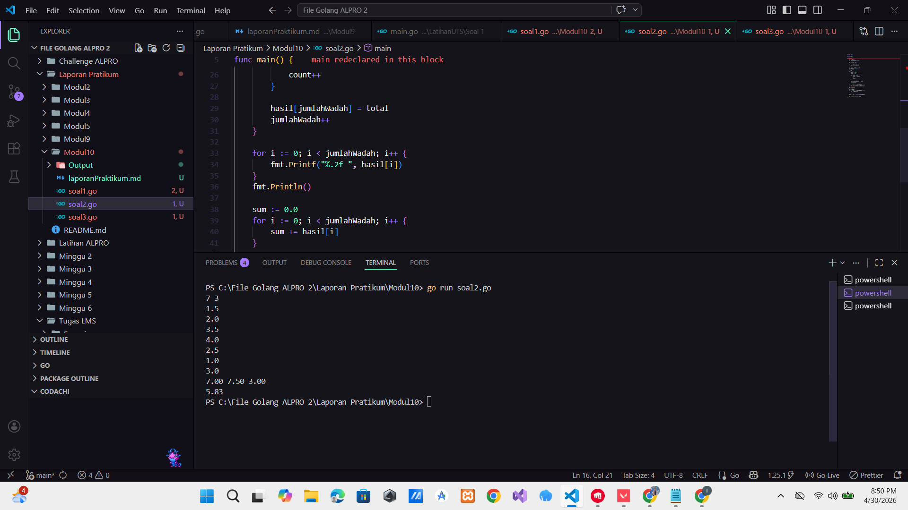
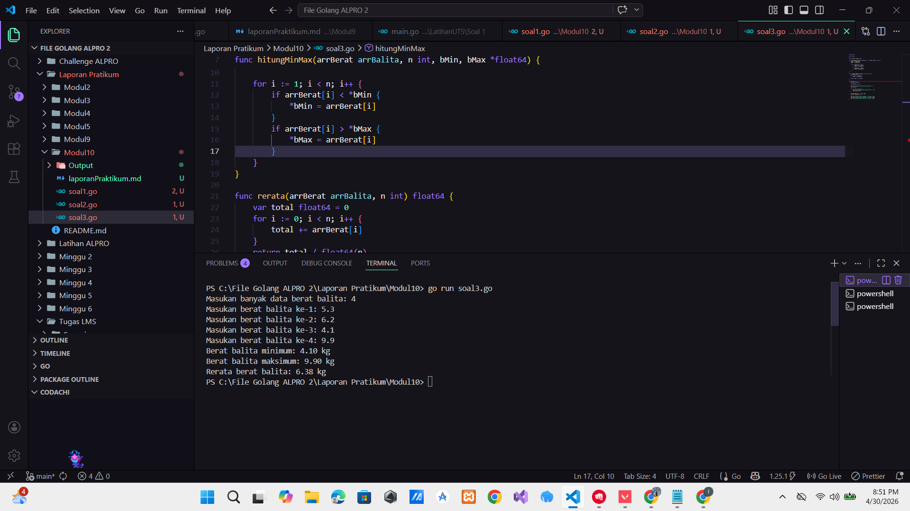

# <h1 align="center">Laporan Praktikum Modul 3 - ... </h1>

<p align="center">Hilkia Farrel Azaria - 109082500205</p>

## Unguided

### 1. [Soal]

#### soal1.go

```go
package main

import "fmt"

func main() {
	var n int
	var berat [1000]float64

	fmt.Print("Masukkan jumlah kelinci: ")
	fmt.Scan(&n)

	if n <= 0 || n > 1000 {
		fmt.Println("Jumlah tidak valid")
		return
	}

	fmt.Println("Masukkan berat kelinci:")
	for i := 0; i < n; i++ {
		fmt.Scan(&berat[i])
	}

	min := berat[0]
	max := berat[0]

	for i := 1; i < n; i++ {
		if berat[i] < min {
			min = berat[i]
		}
		if berat[i] > max {
			max = berat[i]
		}
	}

	fmt.Printf("Berat terkecil: %.2f\n", min)
	fmt.Printf("Berat terbesar: %.2f\n", max)
}

```

### Output Unguided :

##### Output


[penjelasan]

Program di atas adalah program untuk mencari berat kelinci terkecil dan terbesar dari sejumlah data yang dimasukkan oleh pengguna. Di awal program saya membuat dua variabel yaitu n bertipe integer untuk menyimpan jumlah kelinci, dan berat berupa array dengan kapasitas 1000 bertipe float64 untuk menyimpan berat masing-masing kelinci. Lalu selanjutnya program meminta pengguna memasukkan jumlah kelinci. lalu setelah itu dilakukan pengecekan apakah nilai n valid atau tidak jika n kurang dari atau sama dengan 0, atau lebih dari 1000, maka program akan menampilkan pesan "Jumlah tidak valid" dan program langsung dihentikan dengan return lalu program akan meminta pengguna memasukkan berat kelinci sebanyak n kali menggunakan perulangan for. Setiap input disimpan ke dalam array berat. Setelah semua data dimasukkan, program menginisialisasi dua variabel yaitu min dan max dengan nilai awal dari elemen pertama array (berat[0]). Komadina program melakukan perulangan mulai dari indeks ke-1 sampai ke-(n-1). Di dalam perulangan ini, setiap nilai berat dibandingkan Jika berat saat ini lebih kecil dari min, maka nilai min diperbarui. Jika berat saat ini lebih besar dari max, maka nilai max diperbarui. Lalu program menampilkan hasil berat terkecil dan terbesar.

### 2. [Soal]

#### soal2.go

```go
package main

import "fmt"

func main() {
	var x, y int
	var ikan [1000]float64

	fmt.Scan(&x, &y)

	for i := 0; i < x; i++ {
		fmt.Scan(&ikan[i])
	}

	var hasil [1000]float64
	jumlahWadah := 0

	i := 0
	for i < x {
		total := 0.0
		count := 0

		for count < y && i < x {
			total += ikan[i]
			i++
			count++
		}

		hasil[jumlahWadah] = total
		jumlahWadah++
	}

	for i := 0; i < jumlahWadah; i++ {
		fmt.Printf("%.2f ", hasil[i])
	}
	fmt.Println()

	sum := 0.0
	for i := 0; i < jumlahWadah; i++ {
		sum += hasil[i]
	}

	rata := sum / float64(jumlahWadah)

	fmt.Printf("%.2f\n", rata)
}

```

### Output Unguided :

##### Output


[penjelasan]

Program di atas adalah program untuk mengelompokkan berat ikan ke dalam beberapa wadah lalu menghitung total berat tiap wadah dan rata-rata total berat semua wadah. Di awal program saya mendeklarasikan variabel x dan y bertipe integer. Variabel x digunakan untuk menyimpan jumlah ikan lalu sedangkan y digunakan untuk menyimpan kapasitas ikan dalam satu wadah. Selain itu saya juga membuat array ikan dengan kapasitas 1000 bertipe float64 untuk menyimpan berat masing-masing ikan. Dan kemudian program membaca input dari pengguna untuk mengisi jumlah ikan dan kapasitas wadah. Setelah itu program melakukan perulangan sebanyak x kali untuk menginput berat setiap ikan ke dalam array ikan. Dan saya membuat array hasil untuk menyimpan total berat ikan di setiap wadah serta variabel jumlahWadah untuk menghitung berapa banyak wadah yang terbentuk. Di dalam perulangan saya membuat variabel total untuk menjumlahkan berat ikan dalam satu wadah dan count untuk menghitung jumlah ikan yang sudah dimasukkan ke wadah tersebut. Lalu Stelah itu terdapat perulangan kedua for count < y && i < x yang berfungsi untuk memasukkan ikan ke dalam satu wadah sampai jumlahnya mencapai kapasitas y atau ikan sudah habis Setiap berat ikan dijumlahkan ke dalam total kemudian indeks i dan count ditambah. Setelah satu wadah penuh atau ikan habis nilai total disimpan ke dalam array hasil pada indeks jumlahWadah lalu jumlahWadah ditambah satu untuk menandakan bertambahnya wadah. Dan setelah semua ikan selesai dikelompokkan program menampilkan total berat setiap wadah menggunakan perulangan. Kemudian program menghitung jumlah seluruh berat wadah dengan menjumlahkan semua isi array hasil ke dalam variabel sum. Dan terakhir program menghitung rata-rata berat per wadah dengan rumus rata = sum / jumlahWadah, lalu menampilkan hasilnya dengan format dua angka di belakang koma.

### 3. [Soal]

#### soal3.go

```go
package main

import "fmt"

type arrBalita [100]float64

func hitungMinMax(arrBerat arrBalita, n int, bMin, bMax *float64) {
	*bMin = arrBerat[0]
	*bMax = arrBerat[0]

	for i := 1; i < n; i++ {
		if arrBerat[i] < *bMin {
			*bMin = arrBerat[i]
		}
		if arrBerat[i] > *bMax {
			*bMax = arrBerat[i]
		}
	}
}

func rerata(arrBerat arrBalita, n int) float64 {
	var total float64 = 0
	for i := 0; i < n; i++ {
		total += arrBerat[i]
	}
	return total / float64(n)
}

func main() {
	var arr arrBalita
	var n int
	var min, max float64

	fmt.Print("Masukan banyak data berat balita: ")
	fmt.Scan(&n)

	for i := 0; i < n; i++ {
		fmt.Printf("Masukan berat balita ke-%d: ", i+1)
		fmt.Scan(&arr[i])
	}

	hitungMinMax(arr, n, &min, &max)
	rata := rerata(arr, n)

	fmt.Printf("Berat balita minimum: %.2f kg\n", min)
	fmt.Printf("Berat balita maksimum: %.2f kg\n", max)
	fmt.Printf("Rerata berat balita: %.2f kg\n", rata)
}

```

### Output Unguided :

##### Output


[penjelasan]

Program di atas adalah program untuk mengolah data berat balita menggunakan array. Di awal saya membuat tipe data baru bernama arrBalita yang merupakan array dengan kapasitas 100 elemen bertipe float64. Array ini digunakan untuk menyimpan data berat balita. Kemudian saya membuat sebuah fungsi bernama hitungMinMax yang memiliki parameter arrBerat sebagai array data berat balita dan n sebagai jumlah data yang digunakan dan bMin dan bMax sebagai pointer untuk menyimpan nilai minimum dan maksimum Di dalam fungsi pertama-tama nilai minimum dan maksimum diinisialisasi dengan elemen pertama array (arrBerat[0]). Setelah itu dilakukan perulangan dari indeks ke-1 sampai n-1. Pada setiap perulangan Jika data lebih kecil dari nilai minimum, maka nilai minimum diperbarui dan Jika data lebih besar dari nilai maksimum, maka nilai maksimum diperbarui lalu Selanjutnya saya membuat fungsi rerata yang digunakan untuk menghitung rata-rata berat balita. Fungsi ini menerima parameter array dan jumlah data n lalu Menjumlahkan semua elemen array menggunakan perulangan dan Setelah itu total dibagi dengan n untuk mendapatkan nilai rata-rata dan Hasilnya dikembalikan Pada main saya mendeklarasikan Variabel arr untuk menyimpan data berat balita dan Variabel n untuk jumlah data lalu Variabel min dan max untuk hasil minimum dan maksimum Program kemudian meminta pengguna memasukkan jumlah data. Setelah itu dilakukan perulangan sebanyak n kali untuk mengisi array dengan berat balita yang dimasukkan oleh pengguna. Setelah data dimasukkan Fungsi hitungMinMax dipanggil untuk mendapatkan nilai minimum dan maksimum dan Fungsi rerata dipanggil untuk menghitung rata-rata dan yang terakhir program menampilkan hasil Berat balita minimum, Berat balita maksimum dan Rata-rata berat balita
