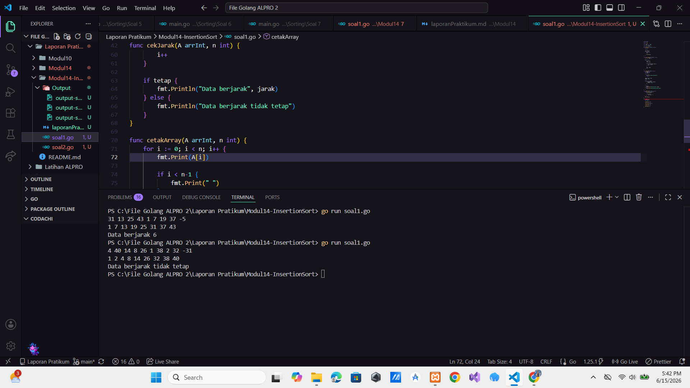
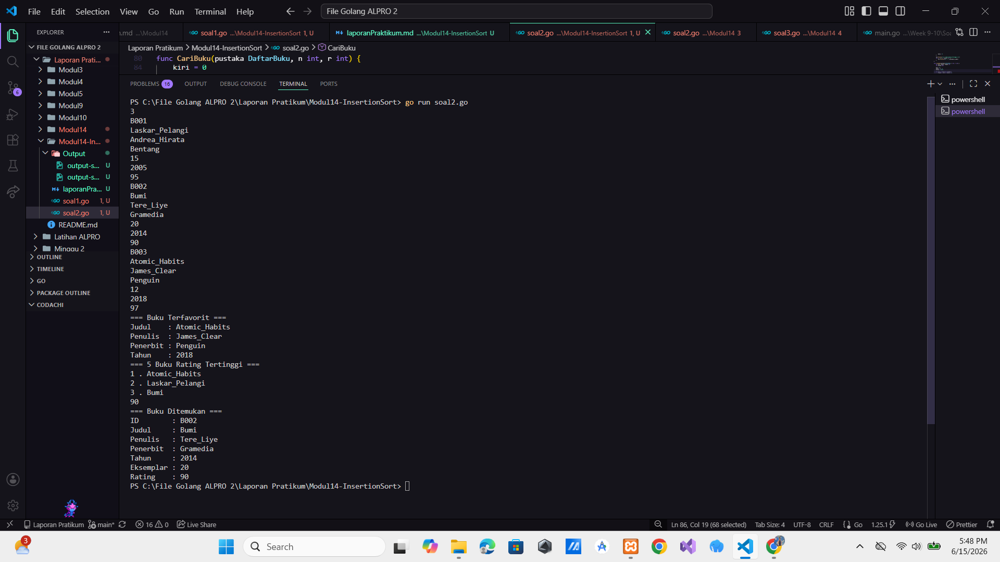

# <h1 align="center">Laporan Praktikum Modul 3 - ... </h1>

<p align="center">Hilkia Farrel Azaria - 109082500205</p>

## Unguided

### 1. [Soal]

#### soal1.go

```go
package main

import "fmt"

const NMAX int = 1000

type arrInt [NMAX]int

func bacaData(A *arrInt, n *int) {
	var x int

	*n = 0

	fmt.Scan(&x)
	for x >= 0 {
		A[*n] = x
		*n++

		fmt.Scan(&x)
	}
}

func insertionSort(A *arrInt, n int) {
	var i, j, temp int

	i = 1
	for i <= n-1 {
		j = i
		temp = A[j]

		// ascending
		for j > 0 && temp < A[j-1] {
			A[j] = A[j-1]
			j--
		}

		A[j] = temp
		i++
	}
}

func cekJarak(A arrInt, n int) {
	var jarak int
	var tetap bool
	var i int

	if n <= 1 {
		fmt.Println("Data berjarak 0")
		return
	}

	jarak = A[1] - A[0]
	tetap = true

	i = 2
	for i < n && tetap {
		if A[i]-A[i-1] != jarak {
			tetap = false
		}
		i++
	}

	if tetap {
		fmt.Println("Data berjarak", jarak)
	} else {
		fmt.Println("Data berjarak tidak tetap")
	}
}

func cetakArray(A arrInt, n int) {
	for i := 0; i < n; i++ {
		fmt.Print(A[i])

		if i < n-1 {
			fmt.Print(" ")
		}
	}
	fmt.Println()
}

func main() {
	var A arrInt
	var n int

	bacaData(&A, &n)

	insertionSort(&A, n)

	cetakArray(A, n)

	cekJarak(A, n)
}

```

### Output Unguided :

##### Output


[penjelasan]

Program di atas adalah program untuk membaca sekumpulan bilangan bulat mengurutkannya menggunakan algoritma Insertion Sort secara membesar (ascending) kemudian memeriksa apakah selisih antar data yang telah diurutkan memiliki jarak yang tetap atau tidak. Di awal program dibuat sebuah konstanta NMAX dengan nilai 1000 yang digunakan sebagai kapasitas maksimum array lalu dibuat tipe data arrInt berupa array integer yang digunakan untuk menyimpan data bilangan yang dimasukkan pengguna kemudian terdapat prosedur bacaData yang digunakan untuk membaca data dari masukan. Prosedur ini menerima parameter array A dan variabel n yang menyimpan jumlah data. Pada awalnya nilai n diatur menjadi 0 dan program kemudian membaca sebuah bilangan menggunakan fmt.Scan(&x) jadi selama nilai yang dimasukkan tidak negatif (x ≥ 0) data tersebut akan disimpan ke dalam array pada indeks ke-n lalu kemudian nilai n ditambah satu proses ini terus dilakukan sampai pengguna memasukkan bilangan negatif yang berfungsi sebagai penanda akhir input. Dan selanjutnya terdapat prosedur insertionSort yang digunakan untuk mengurutkan data secara ascending menggunakan algoritma Insertion Sort prosedur ini menerima parameter array A dan jumlah data n. Di dalamnya digunakan variabel i, j, dan temp variabel temp digunakan untuk menyimpan sementara nilai yang sedang diproses setiap elemen akan dibandingkan dengan elemen-elemen sebelumnya yang sudah terurut dan jika nilai pada temp lebih kecil dari elemen sebelumnya maka elemen tersebut digeser satu posisi ke kanan proses ini terus dilakukan sampai ditemukan posisi yang sesuai untuk temp kemudian nilai tersebut ditempatkan pada posisi yang benar. Lalu setelah proses pengurutan selesai program memanggil prosedur cetakArray untuk menampilkan seluruh data yang sudah terurut prosedur ini melakukan perulangan dari indeks pertama hingga indeks terakhir sesuai jumlah data n setiap elemen dicetak ke layar dan Berikutnya terdapat prosedur cekJarak yang digunakan untuk memeriksa apakah selisih antar elemen yang telah diurutkan memiliki jarak yang tetap. Jika jumlah data kurang dari atau sama dengan satu program langsung menampilkan bahwa data berjarak 0 dan Jika jumlah data lebih dari satu program menghitung selisih dua elemen pertama dan menyimpannya ke dalam variabel jarak. Lalu selanjutnya dilakukan perulangan untuk membandingkan selisih setiap pasangan elemen yang berurutan dengan nilai jarak tersebut. Jika ditemukan selisih yang berbeda variabel tetap diubah menjadi false setelah seluruh data diperiksa jika tetap masih bernilai true program menampilkan bahwa data memiliki jarak yang tetap beserta nilainya. Dan jika terdapat perbedaan selisih program menampilkan bahwa data memiliki jarak yang tidak tetap. Dan di main program terlebih dahulu membuat variabel A bertipe arrInt untuk menyimpan data dan variabel n untuk menyimpan jumlah data. Program kemudian memanggil prosedur bacaData untuk membaca seluruh bilangan yang dimasukkan pengguna sampai ditemukan bilangan negatif. Setelah itu program memanggil insertionSort untuk mengurutkan data secara ascending. Data yang telah terurut kemudian ditampilkan menggunakan cetakArray dan terakhir program memanggil cekJarak untuk menentukan apakah data tersebut memiliki selisih yang tetap atau tidak.

### 2. [Soal]

#### soal2.go

```go
package main

import "fmt"

const nMax = 7919

type Buku struct {
	id, judul, penulis, penerbit string
	eksemplar, tahun, rating     int
}

type DaftarBuku [nMax]Buku

func DaftarkanBuku(pustaka *DaftarBuku, n *int) {
	fmt.Scan(n)

	for i := 0; i < *n; i++ {
		fmt.Scan(
			&pustaka[i].id,
			&pustaka[i].judul,
			&pustaka[i].penulis,
			&pustaka[i].penerbit,
			&pustaka[i].eksemplar,
			&pustaka[i].tahun,
			&pustaka[i].rating,
		)
	}
}

func CetakTerfavorit(pustaka DaftarBuku, n int) {
	var idxMax int = 0

	for i := 1; i < n; i++ {
		if pustaka[i].rating > pustaka[idxMax].rating {
			idxMax = i
		}
	}

	fmt.Println("=== Buku Terfavorit ===")
	fmt.Println("Judul    :", pustaka[idxMax].judul)
	fmt.Println("Penulis  :", pustaka[idxMax].penulis)
	fmt.Println("Penerbit :", pustaka[idxMax].penerbit)
	fmt.Println("Tahun    :", pustaka[idxMax].tahun)
}

func UrutBuku(pustaka *DaftarBuku, n int) {
	var temp Buku
	var i, j int

	i = 1
	for i <= n-1 {
		j = i
		temp = pustaka[j]

		for j > 0 && temp.rating > pustaka[j-1].rating {
			pustaka[j] = pustaka[j-1]
			j--
		}

		pustaka[j] = temp
		i++
	}
}

func Cetak5Terbaru(pustaka DaftarBuku, n int) {
	var batas int

	if n < 5 {
		batas = n
	} else {
		batas = 5
	}

	fmt.Println("=== 5 Buku Rating Tertinggi ===")
	for i := 0; i < batas; i++ {
		fmt.Println(i+1, ".", pustaka[i].judul)
	}
}

func CariBuku(pustaka DaftarBuku, n int, r int) {
	var kiri, kanan, tengah int
	var ketemu bool

	kiri = 0
	kanan = n - 1
	ketemu = false

	for kiri <= kanan && !ketemu {
		tengah = (kiri + kanan) / 2

		if pustaka[tengah].rating == r {
			ketemu = true
		} else if r > pustaka[tengah].rating {
			kanan = tengah - 1
		} else {
			kiri = tengah + 1
		}
	}

	if ketemu {
		fmt.Println("=== Buku Ditemukan ===")
		fmt.Println("ID        :", pustaka[tengah].id)
		fmt.Println("Judul     :", pustaka[tengah].judul)
		fmt.Println("Penulis   :", pustaka[tengah].penulis)
		fmt.Println("Penerbit  :", pustaka[tengah].penerbit)
		fmt.Println("Tahun     :", pustaka[tengah].tahun)
		fmt.Println("Eksemplar :", pustaka[tengah].eksemplar)
		fmt.Println("Rating    :", pustaka[tengah].rating)
	} else {
		fmt.Println("Tidak ada buku dengan rating seperti itu")
	}
}

func main() {
	var pustaka DaftarBuku
	var n, ratingCari int

	DaftarkanBuku(&pustaka, &n)

	CetakTerfavorit(pustaka, n)

	UrutBuku(&pustaka, n)

	Cetak5Terbaru(pustaka, n)

	fmt.Scan(&ratingCari)

	CariBuku(pustaka, n, ratingCari)
}
```

### Output Unguided :

##### Output


[penjelasan]

Program di atas adalah program untuk mengelompokkan dan mengurutkan bilangan ganjil dan genap menggunakan algoritma Selection Sort. Di awal program dibuat konstanta NMAX dengan nilai 1000000 sebagai kapasitas maksimum array, kemudian dibuat tipe data arrInt berupa array integer untuk menyimpan data bilangan. Selanjutnya terdapat dua fungsi, yaitu selectionSortAsc dan selectionSortDesc. Fungsi selectionSortAsc digunakan untuk mengurutkan data secara menaik (ascending) dengan mencari nilai terkecil pada bagian array yang belum terurut, lalu menukarnya ke posisi yang sesuai. Sedangkan fungsi selectionSortDesc digunakan untuk mengurutkan data secara menurun (descending) dengan mencari nilai terbesar dan menempatkannya pada posisi yang tepat. Pada fungsi main program terlebih dahulu membaca nilai n yang menyatakan jumlah kasus data. Untuk setiap kasus, program membaca nilai m sebagai jumlah bilangan yang akan diproses. Setiap bilangan yang diinput kemudian diperiksa apakah termasuk ganjil atau genap. Bilangan ganjil disimpan ke dalam array ganjil, sedangkan bilangan genap disimpan ke dalam array genap. Setelah seluruh data pada suatu kasus selesai dibaca, array ganjil diurutkan secara ascending menggunakan fungsi selectionSortAsc, sedangkan array genap diurutkan secara descending menggunakan fungsi selectionSortDesc. Setelah proses pengurutan selesai, program menampilkan seluruh bilangan ganjil yang telah terurut terlebih dahulu, kemudian diikuti oleh bilangan genap yang juga telah terurut sesuai ketentuan output yang diminta.
