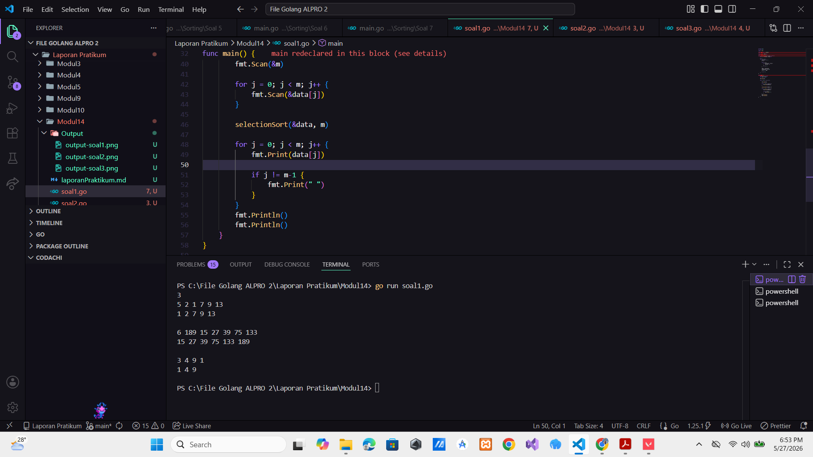
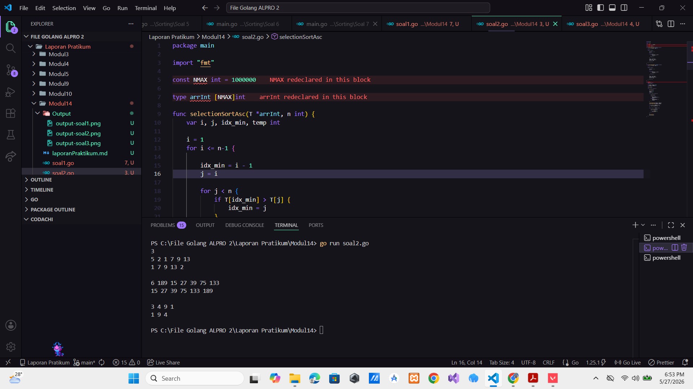
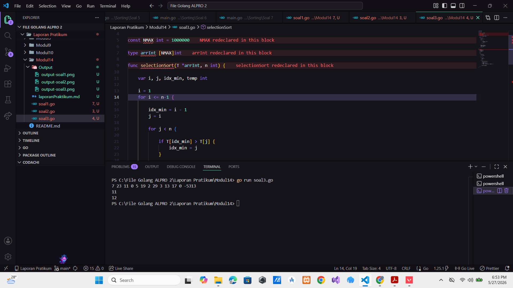

# <h1 align="center">Laporan Praktikum Modul 3 - ... </h1>

<p align="center">Hilkia Farrel Azaria - 109082500205</p>

## Unguided

### 1. [Soal]

#### soal1.go

```go
package main

import "fmt"

const NMAX int = 1000000

type arrInt [NMAX]int

func selectionSort(T *arrInt, n int) {
	var i, j, idx_min, temp int

	i = 1
	for i <= n-1 {
		idx_min = i - 1
		j = i

		for j < n {
			if T[idx_min] > T[j] {
				idx_min = j
			}
			j = j + 1
		}

		temp = T[idx_min]
		T[idx_min] = T[i-1]
		T[i-1] = temp

		i = i + 1
	}
}

func main() {
	var n, m, i, j int
	var data arrInt

	fmt.Scan(&n)

	for i = 0; i < n; i++ {

		fmt.Scan(&m)

		for j = 0; j < m; j++ {
			fmt.Scan(&data[j])
		}

		selectionSort(&data, m)

		for j = 0; j < m; j++ {
			fmt.Print(data[j])

			if j != m-1 {
				fmt.Print(" ")
			}
		}
		fmt.Println()
		fmt.Println()
	}
}


```

### Output Unguided :

##### Output


[penjelasan]

Program di atas adalah program untuk mengurutkan nomor rumah kerabat Hercules menggunakan algoritma Selection Sort secara membesar. Di awal program saya membuat sebuah konstanta NMAX dengan nilai 1000000 sebagai kapasitas maksimum array. Kemudian saya membuat tipe data arrInt berupa array integer untuk menyimpan data nomor rumah. dan selanjutnya terdapat fungsi selectionSort yang digunakan untuk mengurutkan data. Fungsi ini menerima parameter array T dan jumlah data n. Di dalam fungsi tersebut digunakan beberapa variabel yaitu i, j, idx_min, dan temp. Variabel idx_min digunakan untuk menyimpan indeks nilai terkecil, sedangkan temp digunakan sebagai variabel sementara saat proses pertukaran data (swap). Proses selection sort dimulai dari indeks pertama array. Pada setiap perulangan program akan mencari nilai terkecil dari bagian array yang belum terurut. Jika ditemukan nilai yang lebih kecil dari nilai pada idx_min, maka idx_min akan diperbarui mengikuti posisi nilai terkecil tersebut lalu setelah seluruh data diperiksa nilai terkecil akan ditukar dengan elemen pada posisi awal bagian array yang belum terurut dan Proses ini dilakukan terus menerus sampai seluruh data terurut membesar. Dan di main program terlebih dahulu membuat variabel n untuk menyimpan jumlah daerah kerabat Hercules variabel m untuk menyimpan jumlah rumah di setiap daerah dan array data untuk menyimpan nomor rumah. Program kemudian meminta pengguna memasukkan jumlah daerah menggunakan fmt.Scan(&n). Lalu setelah itu program melakukan perulangan sebanyak n kali untuk setiap daerah. Pada setiap daerah program meminta input jumlah rumah m. Selanjutnya dilakukan perulangan sebanyak m kali untuk membaca nomor rumah dan menyimpannya ke dalam array data. Setelah semua nomor rumah pada suatu daerah dimasukkan program memanggil fungsi selectionSort untuk mengurutkan data rumah secara ascending. Setelah data selesai diurutkan program mencetak seluruh nomor rumah yang sudah terurut menggunakan perulangan. Jika data belum berada pada indeks terakhir program akan mencetak spasi agar format output sesuai.

### 2. [Soal]

#### soal2.go

```go
package main

import "fmt"

const NMAX int = 1000000

type arrInt [NMAX]int

func selectionSortAsc(T *arrInt, n int) {
	var i, j, idx_min, temp int

	i = 1
	for i <= n-1 {

		idx_min = i - 1
		j = i

		for j < n {
			if T[idx_min] > T[j] {
				idx_min = j
			}
			j = j + 1
		}

		temp = T[idx_min]
		T[idx_min] = T[i-1]
		T[i-1] = temp

		i = i + 1
	}
}

func selectionSortDesc(T *arrInt, n int) {
	var i, j, idx_max, temp int

	i = 1
	for i <= n-1 {

		idx_max = i - 1
		j = i

		for j < n {
			if T[idx_max] < T[j] {
				idx_max = j
			}
			j = j + 1
		}

		temp = T[idx_max]
		T[idx_max] = T[i-1]
		T[i-1] = temp

		i = i + 1
	}
}

func main() {
	var n, m, x int
	var i, j int

	var ganjil, genap arrInt
	var nGanjil, nGenap int

	fmt.Scan(&n)

	for i = 0; i < n; i++ {

		fmt.Scan(&m)

		nGanjil = 0
		nGenap = 0

		for j = 0; j < m; j++ {

			fmt.Scan(&x)

			if x%2 == 1 {
				ganjil[nGanjil] = x
				nGanjil++
			} else {
				genap[nGenap] = x
				nGenap++
			}
		}

		selectionSortAsc(&ganjil, nGanjil)
		selectionSortDesc(&genap, nGenap)

		for j = 0; j < nGanjil; j++ {
			fmt.Print(ganjil[j], " ")
		}

		for j = 0; j < nGenap; j++ {

			fmt.Print(genap[j])

			if j != nGenap-1 {
				fmt.Print(" ")
			}
		}

		fmt.Println()
		fmt.Println()
	}
}


```

### Output Unguided :

##### Output


[penjelasan]

Program di atas adalah program untuk mengelompokkan dan mengurutkan nomor rumah kerabat Hercules berdasarkan bilangan ganjil dan genap menggunakan algoritma Selection Sort. Pada awal program saya membuat konstanta NMAX dengan nilai 1000000 yang sebagai kapasitas maksimum array. Kemudian saya membuat tipe data arrInt berupa array integer untuk menyimpan data nomor rumah. Dan selanjutnya terdapat dua fungsi yaitu selectionSortAsc dan selectionSortDesc. Fungsi selectionSortAsc untuk mengurutkan data secara ascending atau membesar menggunakan algoritma Selection Sort. Di dalam fungsi ini terdapat variabel i, j, idx_min, dan temp. Variabel idx_min untuk menyimpan indeks nilai terkecil, sedangkan temp sebagai variabel sementara ketika melakukan pertukaran data. Proses pengurutan dilakukan dengan mencari nilai terkecil dari bagian array yang belum terurut lalu kemudian menukarnya dengan elemen di posisi awal bagian array tersebut Proses ini dilakukan berulang hingga seluruh data terurut membesar. Dan fungsi kedua yaitu selectionSortDesc untuk mengurutkan data secara descending atau mengecil. Hampir sama dengan fungsi sebelum nya tapi pada fungsi ini program mencari nilai terbesar menggunakan variabel idx_max. Setelah nilai terbesar ditemukan data tersebut ditukar dengan elemen pada posisi awal bagian array yang belum terurut Proses ini dilakukan terus menerus sampai seluruh data terurut mengecil. Lalu pada fungsi main program membuat beberapa variabel yaitu n untuk menyimpan jumlah daerah m untuk menyimpan jumlah rumah pada setiap daerah, dan x untuk menyimpan sementara nomor rumah yang diinput. Selain itu dibuat dua array yaitu ganjil dan genap untuk memisahkan nomor rumah berdasarkan jenis bilangannya variabel nGanjil dan nGenap untuk menghitung banyaknya data ganjil dan genap. Dan program kemudian meminta pengguna memasukkan jumlah daerah menggunakan fmt.Scan(&n). Lalu setelah itu program melakukan perulangan sebanyak n kali untuk memproses setiap daerah. Program meminta input jumlah rumah m dan selanjutnya dilakukan perulangan sebanyak m kali untuk membaca nomor rumah satu per satu. Setiap nomor rumah yang dimasukkan akan diperiksa menggunakan operasi modulus Jika x%2 == 1 maka angka tersebut termasuk bilangan ganjil dan disimpan ke array ganjil. Dan jika tidak maka angka tersebut termasuk bilangan genap dan disimpan ke array genap. Setiap kali data dimasukkan variabel penghitung jumlah data ganjil atau genap akan bertambah. Dan setelah semua data selesai diinputkan lalu memanggil fungsi selectionSortAsc untuk mengurutkan array ganjil secara membesar dan memanggil fungsi selectionSortDesc untuk mengurutkan array genap secara mengecil. Dan kemudian program mencetak seluruh bilangan ganjil yang sudah terurut ascending terlebih dahulu menggunakan perulangan for. Setelah itu program mencetak seluruh bilangan genap yang sudah terurut descending.

### 3. [Soal]

#### soal3.go

```go
package main

import "fmt"

const NMAX int = 1000000

type arrInt [NMAX]int

func selectionSort(T *arrInt, n int) {

	var i, j, idx_min, temp int

	i = 1
	for i <= n-1 {

		idx_min = i - 1
		j = i

		for j < n {

			if T[idx_min] > T[j] {
				idx_min = j
			}

			j = j + 1
		}

		temp = T[idx_min]
		T[idx_min] = T[i-1]
		T[i-1] = temp

		i = i + 1
	}
}

func main() {
	var data arrInt
	var x, n int
	var median int

	n = 0

	for {

		fmt.Scan(&x)

		if x == -5313 {
			break
		}

		if x != 0 {

			data[n] = x
			n++

		} else {

			selectionSort(&data, n)

			if n%2 == 1 {
				median = data[n/2]
			} else {
				median = (data[(n/2)-1] + data[n/2]) / 2
			}

			fmt.Println(median)
		}
	}
}


```

### Output Unguided :

##### Output


[penjelasan]

Program di atas adalah program untuk mencari nilai median dari sekumpulan data bilangan bulat menggunakan algoritma Selection Sort. Pada awal program dibuat konstanta NMAX dengan nilai 1000000 yang sebagai kapasitas maksimum array. Kemudian dibuat tipe data arrInt berupa array integer untuk menyimpan data angka yang dimasukkan oleh pengguna terdapat fungsi selectionSort untuk mengurutkan data secara membesar atau ascending menggunakan algoritma Selection Sort. Di fungsi ini dibuat beberapa variabel yaitu i, j, idx_min, dan temp. Variabel idx_min untuk menyimpan indeks nilai terkecil dan temp digunakan sebagai variabel sementara saat proses pertukaran data. Proses selection sort dimulai dari indeks pertama array. Pada setiap perulangan program mencari nilai terkecil dari bagian array yang belum terurut. Jika ditemukan nilai yang lebih kecil dari nilai pada posisi idx_min, maka idx_min akan diperbarui mengikuti posisi nilai terkecil tersebut. Setelah seluruh data diperiksa nilai terkecil akan ditukar dengan elemen pada posisi awal bagian array yang belum terurut. Proses ini dilakukan berulang sampai seluruh data terurut membesar. Pada fungsi main program membuat array data untuk menyimpan seluruh angka yang dimasukkan pengguna. Selain itu dibuat variabel x untuk menyimpan input sementara variabel n untuk menghitung jumlah data yang tersimpan dan variabel median untuk menyimpan hasil median. Nilai awal n diisi dengan 0 karena pada awal program belum ada data yang tersimpan dan setelah itu program menggunakan perulangan tak hingga for untuk membaca input angka satu per satu menggunakan fmt.Scan(&x). Program kemudian melakukan pengecekan terhadap nilai input jika nilai x sama dengan -5313 maka program berhenti menggunakan break karena angka tersebut merupakan tanda akhir input. jika nilai x tidak sama dengan 0 maka angka tersebut disimpan ke dalam array data pada indeks ke-n, lalu nilai n ditambah satu untuk menandakan jumlah data bertambah. Jika nilai x sama dengan 0 maka program akan menghitung median dari seluruh data yang sudah tersimpan sebelumnya. Sebelum mencari median program terlebih dahulu memanggil fungsi selectionSort untuk mengurutkan seluruh data secara ascending. Lalu setelah data terurut program memeriksa apakah jumlah data ganjil atau genap menggunakan kondisi n%2 == 1. Jika jumlah data ganjil maka median diambil langsung dari elemen tengah array yaitu data[n/2]. Jika jumlah data genap maka median dihitung dari rata-rata dua elemen tengah yaitu data[(n/2)-1] dan data[n/2] kemudian hasilnya dibagi dua menggunakan pembagian integer sehingga hasil dibulatkan ke bawah. Terakhir program menampilkan nilai median menggunakan fmt.Println(median). Proses ini akan terus dilakukan sampai pengguna memasukkan angka 0 sampai program menerima input -5313
