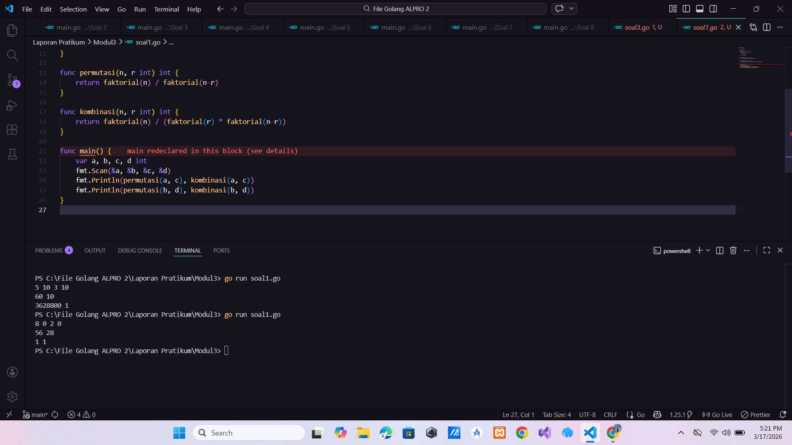
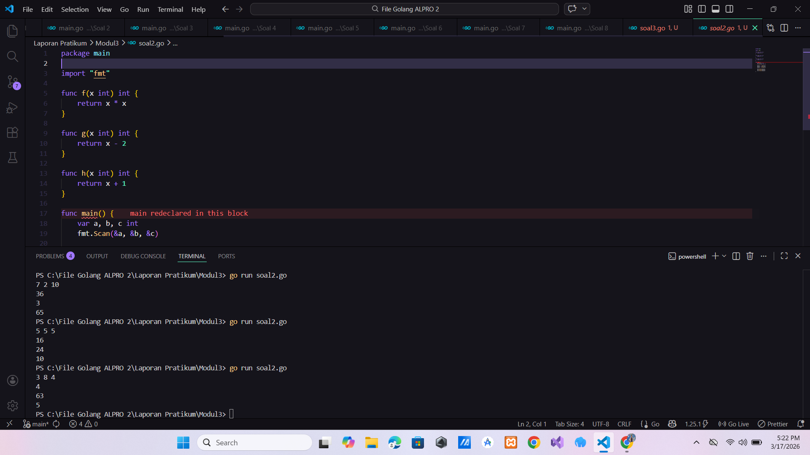
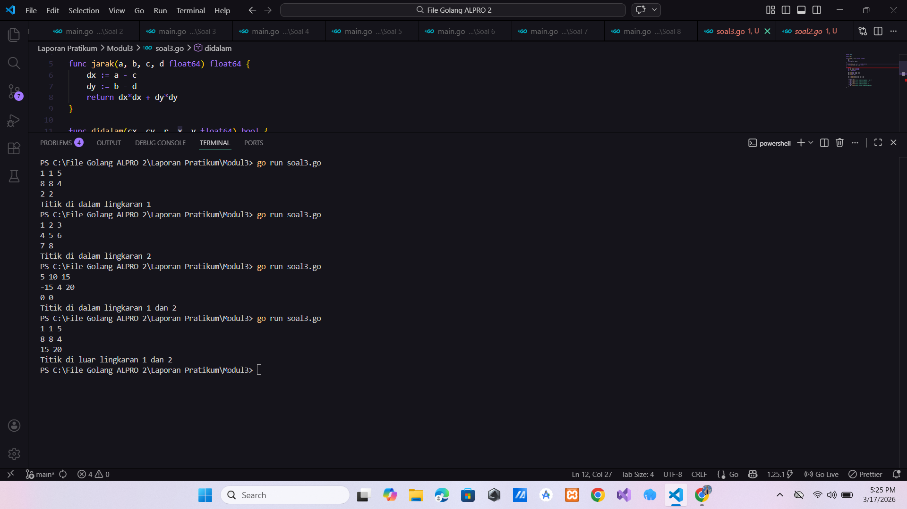

# <h1 align="center">Laporan Praktikum Modul 3 - ... </h1>

<p align="center">Hilkia Farrel Azaria - 109082500205</p>

## Unguided

### 1. [Soal]

#### soal1.go

```go
package main

import "fmt"

func faktorial(n int) int {
	result := 1
	for i := 1; i <= n; i++ {
		result *= i
	}
	return result
}

func permutasi(n, r int) int {
	return faktorial(n) / faktorial(n-r)
}

func kombinasi(n, r int) int {
	return faktorial(n) / (faktorial(r) * faktorial(n-r))
}

func main() {
	var a, b, c, d int
	fmt.Scan(&a, &b, &c, &d)
	fmt.Println(permutasi(a, c), kombinasi(a, c))
	fmt.Println(permutasi(b, d), kombinasi(b, d))
}


```

### Output Unguided :

##### Output


[penjelasan]

Program di atas adalah program kombinasi dan permutasi. lalu saya membuat 3 function yaitu faktorial, kombinasi, dan permutasi. di dalam function main saya membuat variabel a, b, c, d untuk menyimpan nilai inputan, lalu melakukan 4 inputan yang di simpan ke dalam variabel a, b, c, d, lalu membuat outputan dari function permutasi dan membawa nilai a, dan b lalu juga output kombinasi yang membawa nilai a dan c. lalu membuat outputan lagi dimana hasil dari permutasi yang membawa nilai b dan d dan juga function kombinasi b dan d, lalu di function permutasi dengan parameter n, r int dan type function yaitu int lalu di dalam permutasi melakukan return faktorial n bagi function faktorial n-r, dan didalam function faktorial adaparameter n dengan tipe data int dan type function int yang dimana di dalam function melakukan perkalian faktorial dan di function kombinasi dengan parameter n, r int dan type function yaitu int lalu di dalam function kombinasi melakukan return faktorial n bagi function faktorial r kali function faktorial n-r

### 2. [Soal]

#### soal2.go

```go
package main

import "fmt"

func f(x int) int {
	return x * x
}

func g(x int) int {
	return x - 2
}

func h(x int) int {
	return x + 1
}

func main() {
	var a, b, c int
	fmt.Scan(&a, &b, &c)

	hasil1 := f(g(h(a)))
	hasil2 := g(h(f(b)))
	hasil3 := h(f(g(c)))

	fmt.Println(hasil1)
	fmt.Println(hasil2)
	fmt.Println(hasil3)
}


```

### Output Unguided :

##### Output


[penjelasan]

Program di atas adalah program komposisi fungsi. Pada program ini dibuat 3 buah function yaitu f(x), g(x), dan h(x) yang masing-masing melakukan operasi matematika sederhana function f(x) digunakan untuk menghitung kuadrat dari suatu bilangan (x \* x), kemudian function g(x) digunakan untuk mengurangi nilai x dengan 2, dan function h(x) digunakan untuk menambahkan nilai x dengan 1 Di dalam function main, saya membuat 3 variabel yaitu a, b, dan c dengan tipe data integer untuk menyimpan nilai input lqlu saya membuat inputan disimpan ke dalam variabel a, b, dan c dan memanggil hasil function f(g(h(a))) di simpan ke variabel hasil1, memanggil hasil function g(h(f(b))) di simpan ke variabel hasil2, memanggil hasil function h(f(g(c))) di simpan ke variabel hasil3 lalu saya membuat outputan dari hasil1, hasil2, dan hasil3

### 3. [Soal]

#### soal3.go

```go
package main

import "fmt"

func jarak(a, b, c, d float64) float64 {
	dx := a - c
	dy := b - d
	return dx*dx + dy*dy
}

func didalam(cx, cy, r, x, y float64) bool {
	return jarak(cx, cy, x, y) <= r*r
}

func main() {
	var cx1, cy1, r1 float64
	var cx2, cy2, r2 float64
	var x, y float64

	fmt.Scan(&cx1, &cy1, &r1)
	fmt.Scan(&cx2, &cy2, &r2)
	fmt.Scan(&x, &y)

	in1 := didalam(cx1, cy1, r1, x, y)
	in2 := didalam(cx2, cy2, r2, x, y)

	if in1 && in2 {
		fmt.Println("Titik di dalam lingkaran 1 dan 2")
	} else if in1 {
		fmt.Println("Titik di dalam lingkaran 1")
	} else if in2 {
		fmt.Println("Titik di dalam lingkaran 2")
	} else {
		fmt.Println("Titik di luar lingkaran 1 dan 2")
	}
}


```

### Output Unguided :

##### Output


[penjelasan]

Program di atas adalah program untuk menentukan posisi sebuah titik terhadap dua lingkaran menggunakan konsep fungsi pada program ini dibuat 2 buah function yaitu jarak dan didalam function jarak(a, b, c, d) digunakan untuk menghitung jarak antara dua titik yaitu titik (a, b) dan (c, d) lalu function didalam(cx, cy, r, x, y) digunakan untuk mengecek apakah suatu titik (x, y) berada di dalam lingkaran atau tidak dan di function main saya membuat beberapa variabel bertipe data float64 yaitu cx1, cy1, dan r1 lalu cx2, cy2, r2, x dan y kemudian saya membuat inputan di simpan dalam variabel cx1, cy1, r1, cx2, cy2, r2, x dan y dan saya memanggil function didalam dengan membawa nilai variabel cx1, cy1, r1, x, y dan di simpan ke dalam in1 dan saya memanggil function didalam dengan membawa nilai variabel cx2, cy2, r2, x, y dan di simpan ke dalam in2 lalu saya membuat percabangan untuk menentukan output kalau titik berada di dalam kedua lingkaran maka akan ditampilkan Titik di dalam lingkaran 1 dan 2 dan hanya di lingkaran pertama maka ditampilkan Titik di dalam lingkaran 1 lalu jika hanya di lingkaran kedua maka ditampilkan Titik di dalam lingkaran 2 jika tidak berada di keduanya maka ditampilkan Titik di luar lingkaran 1 dan 2
