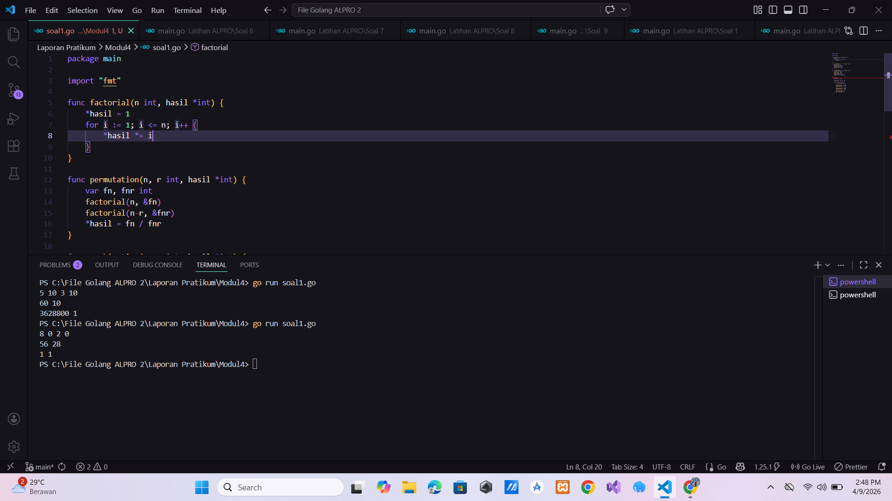
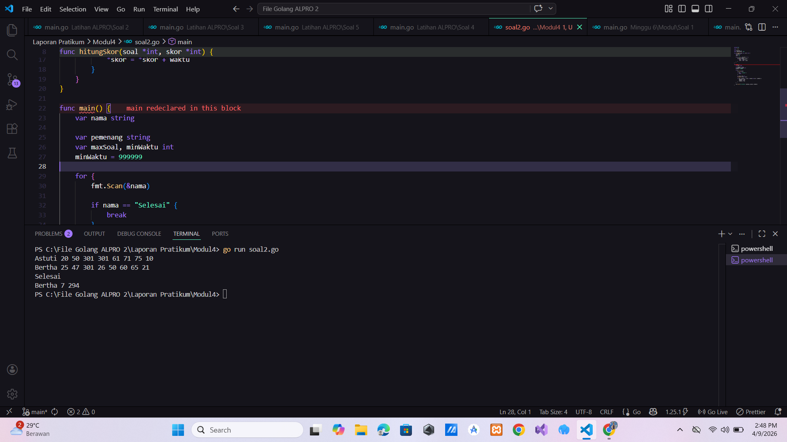

# <h1 align="center">Laporan Praktikum Modul 3 - ... </h1>

<p align="center">Hilkia Farrel Azaria - 109082500205</p>

## Unguided

### 1. [Soal]

#### soal1.go

```go
package main

import "fmt"

func faktorial(n int) int {
	result := 1
	for i := 1; i <= n; i++ {
		result *= i
	}
	return result
}

func permutasi(n, r int) int {
	return faktorial(n) / faktorial(n-r)
}

func kombinasi(n, r int) int {
	return faktorial(n) / (faktorial(r) * faktorial(n-r))
}

func main() {
	var a, b, c, d int
	fmt.Scan(&a, &b, &c, &d)
	fmt.Println(permutasi(a, c), kombinasi(a, c))
	fmt.Println(permutasi(b, d), kombinasi(b, d))
}


```

### Output Unguided :

##### Output


[penjelasan]

Program di atas adalah program untuk menghitung permutasi dan kombinasi dari dua pasang bilangan yang diinput oleh user. Di awal program dibuat beberapa fungsi yaitu factorial, permutation, dan combination untuk membantu proses perhitungan pada fungsi factorial program menghitung nilai faktorial dari suatu bilangan n dengan cara mengalikan angka dari 1 sampai n, lalu hasilnya disimpan ke variabel yang dikirim menggunakan pointer (_hasil) kemudian pada fungsi permutation program menghitung permutasi menggunakan rumus nPr = n! / (n-r)! program memanggil fungsi factorial untuk menghitung n! dan (n-r)! lalu hasilnya dibagi dan disimpan ke variabel hasil selanjutnya pada fungsi combination, program menghitung kombinasi menggunakan rumus nCr = n! / (r! _ (n-r)!). Program juga memanggil fungsi factorial untuk mendapatkan nilai n!, r!, dan (n-r)! kemudian menghitung hasil akhirnya di dalam fungsi main, program menerima 4 input yaitu a, b, c, dan d. Setelah itu dilakukan pengecekan apakah a >= c dan b >= d jika kondisi tersebut terpenuhi, maka program akan menghitung permutasi dan kombinasi untuk pasangan (a, c) dan (b, d) hasil dari perhitungan tersebut disimpan dalam variabel p1, c1, p2, dan c2, lalu ditampilkan ke layar dalam dua baris output, masing-masing berisi hasil permutasi dan kombinasi dari setiap pasangan input.

### 2. [Soal]

#### soal2.go

```go
package main

import "fmt"

func f(x int) int {
	return x * x
}

func g(x int) int {
	return x - 2
}

func h(x int) int {
	return x + 1
}

func main() {
	var a, b, c int
	fmt.Scan(&a, &b, &c)

	hasil1 := f(g(h(a)))
	hasil2 := g(h(f(b)))
	hasil3 := h(f(g(c)))

	fmt.Println(hasil1)
	fmt.Println(hasil2)
	fmt.Println(hasil3)
}


```

### Output Unguided :

##### Output


[penjelasan]

Program di atas adalah program komposisi fungsi. Pada program ini dibuat 3 buah function yaitu f(x), g(x), dan h(x) yang masing-masing melakukan operasi matematika sederhana function f(x) digunakan untuk menghitung kuadrat dari suatu bilangan (x \* x), kemudian function g(x) digunakan untuk mengurangi nilai x dengan 2, dan function h(x) digunakan untuk menambahkan nilai x dengan 1 Di dalam function main, saya membuat 3 variabel yaitu a, b, dan c dengan tipe data integer untuk menyimpan nilai input lqlu saya membuat inputan disimpan ke dalam variabel a, b, dan c dan memanggil hasil function f(g(h(a))) di simpan ke variabel hasil1, memanggil hasil function g(h(f(b))) di simpan ke variabel hasil2, memanggil hasil function h(f(g(c))) di simpan ke variabel hasil3 lalu saya membuat outputan dari hasil1, hasil2, dan hasil3

### 3. [Soal]

#### soal3.go

```go
package main

import "fmt"

const MAX_SOAL = 8
const TIDAK_SELESAI = 301

func hitungSkor(soal *int, skor *int) {
	var waktu int
	*soal = 0
	*skor = 0

	for i := 0; i < MAX_SOAL; i++ {
		fmt.Scan(&waktu)
		if waktu < TIDAK_SELESAI {
			*soal = *soal + 1
			*skor = *skor + waktu
		}
	}
}

func main() {
	var nama string

	var pemenang string
	var maxSoal, minWaktu int
	minWaktu = 999999

	for {
		fmt.Scan(&nama)

		if nama == "Selesai" {
			break
		}

		var soal, skor int
		hitungSkor(&soal, &skor)

		if soal > maxSoal || (soal == maxSoal && skor < minWaktu) {
			pemenang = nama
			maxSoal = soal
			minWaktu = skor
		}
	}

	fmt.Printf("%s %d %d\n", pemenang, maxSoal, minWaktu)
}


```

### Output Unguided :

##### Output


[penjelasan]

Program di atas adalah program untuk menentukan pemenang dari sebuah kompetisi (misalnya lomba pemrograman) berdasarkan jumlah soal yang berhasil diselesaikan dan total waktu pengerjaan di awal program, saya membuat konstanta MAX_SOAL bernilai 8 yang artinya setiap peserta akan mengerjakan maksimal 8 soal, dan TIDAK_SELESAI bernilai 301 yang digunakan sebagai batas waktu dimana jika waktu ≥ 301 berarti soal dianggap tidak selesai Kemudian saya membuat fungsi hitungSkor yang memiliki parameter pointer soal dan skor di dalam fungsi ini, saya menginisialisasi jumlah soal yang dikerjakan (soal) dan total waktu (skor) menjadi 0. Lalu dilakukan perulangan sebanyak 8 kali untuk menerima input waktu pengerjaan tiap soal jika waktu yang diinput kurang dari 301, maka soal dianggap selesai sehingga jumlah soal akan bertambah 1 dan total waktu juga akan ditambahkan dengan waktu tersebut. Jika tidak, maka soal dianggap tidak selesai dan tidak dihitung Pada fungsi main, saya membuat variabel nama untuk menyimpan nama peserta, pemenang untuk menyimpan nama pemenang, maxSoal untuk menyimpan jumlah soal terbanyak yang berhasil diselesaikan, dan minWaktu untuk menyimpan total waktu tercepat. Nilai awal minWaktu dibuat sangat besar agar mudah dibandingkan Kemudian program melakukan perulangan terus menerus untuk membaca nama peserta. Jika nama yang diinput adalah "Selesai", maka perulangan akan berhenti. Untuk setiap peserta, program memanggil fungsi hitungSkor untuk menghitung jumlah soal yang diselesaikan dan total waktunya Setelah itu dilakukan pengecekan, jika jumlah soal peserta lebih banyak dari maxSoal, atau jika jumlah soalnya sama tetapi total waktunya lebih kecil dari minWaktu, maka peserta tersebut akan dijadikan sebagai pemenang sementara dengan memperbarui nilai pemenang, maxSoal, dan minWaktu Terakhir, setelah semua data peserta selesai diproses, program akan menampilkan nama pemenang beserta jumlah soal yang diselesaikan dan total waktunya.
