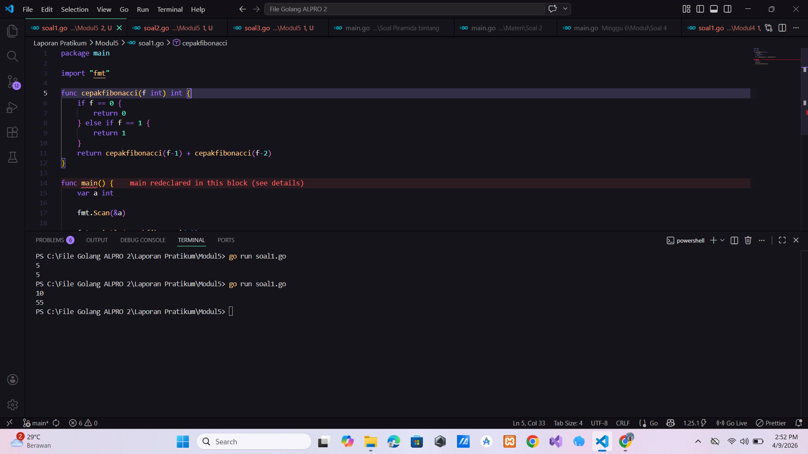
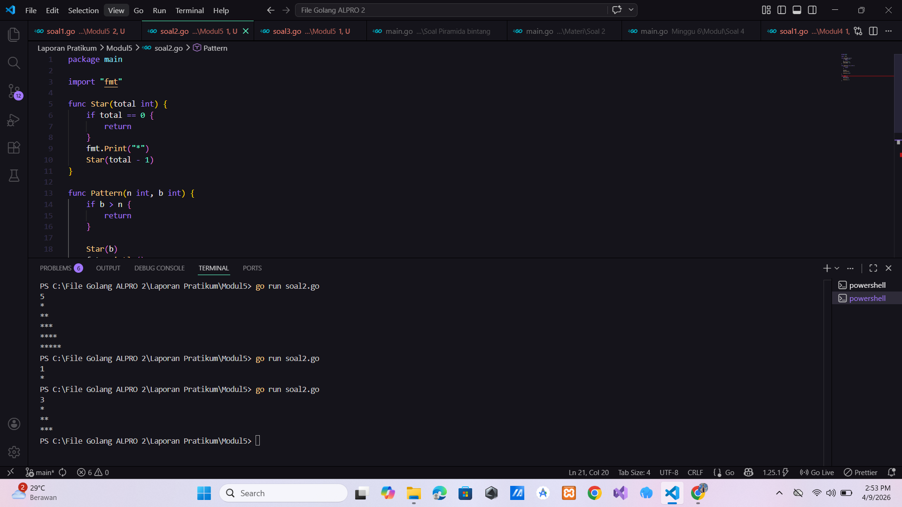
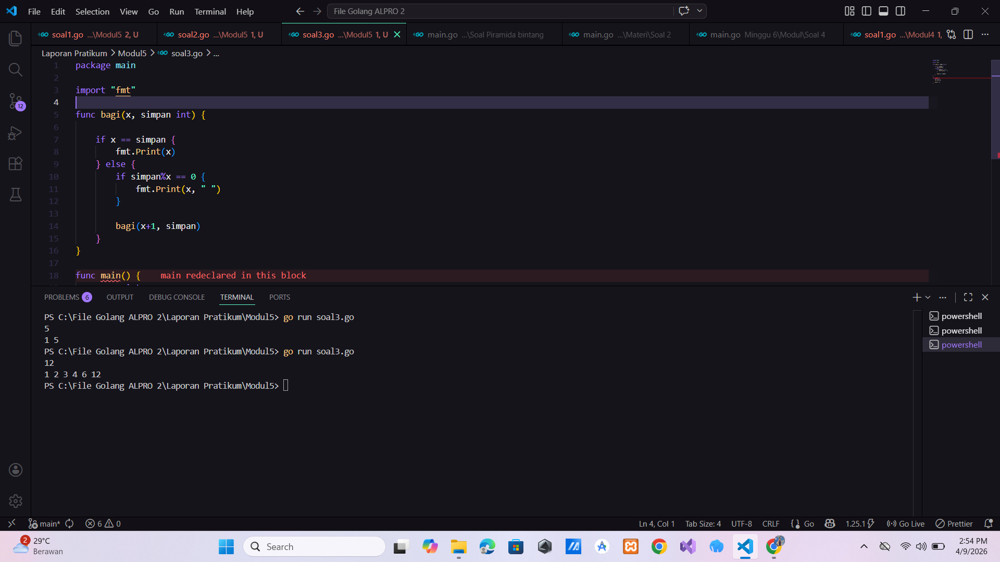

# <h1 align="center">Laporan Praktikum Modul 3 - ... </h1>

<p align="center">Hilkia Farrel Azaria - 109082500205</p>

## Unguided

### 1. [Soal]

#### soal1.go

```go
package main

import "fmt"

func cepakfibonacci(f int) int {
	if f == 0 {
		return 0
	} else if f == 1 {
		return 1
	}
	return cepakfibonacci(f-1) + cepakfibonacci(f-2)
}

func main() {
	var a int

	fmt.Scan(&a)

	fmt.Println(cepakfibonacci(a))
}


```

### Output Unguided :

##### Output


[penjelasan]

Program di atas adalah program untuk menghitung nilai deret Fibonacci menggunakan metode rekursif Di awal saya membuat sebuah fungsi bernama cepakfibonacci dengan parameter f bertipe data integer dan fungsi ini akan mengembalikan nilai integer Di dalam fungsi tersebut terdapat kondisi dasar (base case), yaitu jika f == 0 maka fungsi akan mengembalikan nilai 0, dan jika f == 1 maka akan mengembalikan nilai 1 Kondisi ini penting agar rekursi bisa berhenti Jika nilai f lebih dari 1 maka fungsi akan memanggil dirinya sendiri (rekursif) dengan rumus cepakfibonacci(f-1) + cepakfibonacci(f-2) nilai Fibonacci ke-f didapat dari penjumlahan dua nilai sebelumnya Kemudian pada fungsi main, saya membuat variabel a bertipe integer untuk menyimpan input dari user Setelah itu, program membaca input menggunakan fmt.Scan(&a)Terakhir, program akan menampilkan hasil perhitungan Fibonacci ke-a dengan memanggil fungsi cepakfibonacci(a) menggunakan fmt.Println

### 2. [Soal]

#### soal2.go

```go
package main

import "fmt"

func f(x int) int {
	return x * x
}

func g(x int) int {
	return x - 2
}

func h(x int) int {
	return x + 1
}

func main() {
	var a, b, c int
	fmt.Scan(&a, &b, &c)

	hasil1 := f(g(h(a)))
	hasil2 := g(h(f(b)))
	hasil3 := h(f(g(c)))

	fmt.Println(hasil1)
	fmt.Println(hasil2)
	fmt.Println(hasil3)
}


```

### Output Unguided :

##### Output


[penjelasan]

Program di atas adalah program komposisi fungsi. Pada program ini dibuat 3 buah function yaitu f(x), g(x), dan h(x) yang masing-masing melakukan operasi matematika sederhana function f(x) digunakan untuk menghitung kuadrat dari suatu bilangan (x \* x), kemudian function g(x) digunakan untuk mengurangi nilai x dengan 2, dan function h(x) digunakan untuk menambahkan nilai x dengan 1 Di dalam function main, saya membuat 3 variabel yaitu a, b, dan c dengan tipe data integer untuk menyimpan nilai input lqlu saya membuat inputan disimpan ke dalam variabel a, b, dan c dan memanggil hasil function f(g(h(a))) di simpan ke variabel hasil1, memanggil hasil function g(h(f(b))) di simpan ke variabel hasil2, memanggil hasil Program di atas adalah program untuk menghitung hasil dari kombinasi beberapa fungsi matematika sederhana. Di awal, dibuat tiga buah fungsi yaitu f(x), g(x), dan h(x) yang masing-masing memiliki operasi berbeda. Fungsi f(x) mengembalikan nilai kuadrat dari x (x \* x), fungsi g(x) mengurangi nilai x dengan 2 (x - 2), dan fungsi h(x) menambahkan nilai x dengan 1 (x + 1).

Kemudian pada fungsi main, dibuat tiga variabel yaitu a, b, dan c dengan tipe data integer yang nilainya diinput oleh user setelah itu program menghitung tiga hasil yaitu hasil1, hasil2, dan hasil3 dengan cara menggabungkan (komposisi) fungsi-fungsi yang sudah dibuat sebelumnya untuk hasil1, program menghitung f(g(h(a))) yang artinya nilai a pertama-tama dimasukkan ke fungsi h, lalu hasilnya dimasukkan ke fungsi g, dan hasilnya lagi dimasukkan ke fungsi f. Untuk hasil2, program menghitung g(h(f(b))) yaitu nilai b diproses oleh fungsi f, lalu ke h, kemudian ke g. Sedangkan untuk hasil3, program menghitung h(f(g(c))) yaitu nilai c diproses oleh fungsi g, lalu ke f, dan terakhir ke h di akhir program ketiga hasil tersebut ditampilkan ke layar menggunakan fmt.Println.function h(f(g(c))) di simpan ke variabel hasil3 lalu saya membuat outputan dari hasil1, hasil2, dan hasil3

### 3. [Soal]

#### soal3.go

```go
package main

import "fmt"

func bagi(x, simpan int) {

	if x == simpan {
		fmt.Print(x)
	} else {
		if simpan%x == 0 {
			fmt.Print(x, " ")
		}

		bagi(x+1, simpan)
	}
}

func main() {
	var n int
	fmt.Scan(&n)

	bagi(1, n)
}

```

### Output Unguided :

##### Output


[penjelasan]

Program di atas adalah program untuk menampilkan bilangan pembagi dari suatu angka yang diinput oleh user dimana awal-awal saya membuat sebuah fungsi bernama bagi yang memiliki dua parameter yaitu x dan simpan. Variabel x digunakan sebagai nilai awal pengecekan (dimulai dari 1), sedangkan simpan digunakan untuk menyimpan angka input dari user kemudian di dalam fungsi bagi terdapat kondisi if x == simpan. Jika kondisi ini terpenuhi, maka program akan mencetak nilai x (yang berarti angka terakhir atau angka itu sendiri) dan jika kondisi tersebut tidak terpenuhi, maka program akan masuk ke kondisi berikutnya yaitu if simpan % x == 0. Di sini program akan mengecek apakah x merupakan pembagi dari simpan. Jika iya (hasil modulus = 0), maka nilai x akan dicetak nah setelah itu, fungsi bagi akan memanggil dirinya sendiri (rekursif) dengan nilai x+1 dan simpan tetap, sehingga proses pengecekan akan berlanjut dari 1 sampai ke angka yang diinput di dalam fungsi main, saya membuat variabel n bertipe integer untuk menampung input dari user, kemudian dilakukan fmt.Scan(&n) untuk membaca nilai tersebut. Setelah itu, fungsi bagi dipanggil dengan parameter awal 1 dan n output dari program ini adalah semua bilangan yang dapat membagi habis angka yang diinput, dari 1 hingga angka tersebut.
