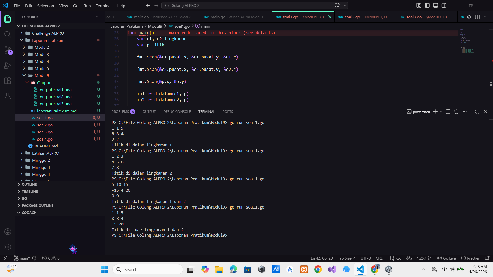
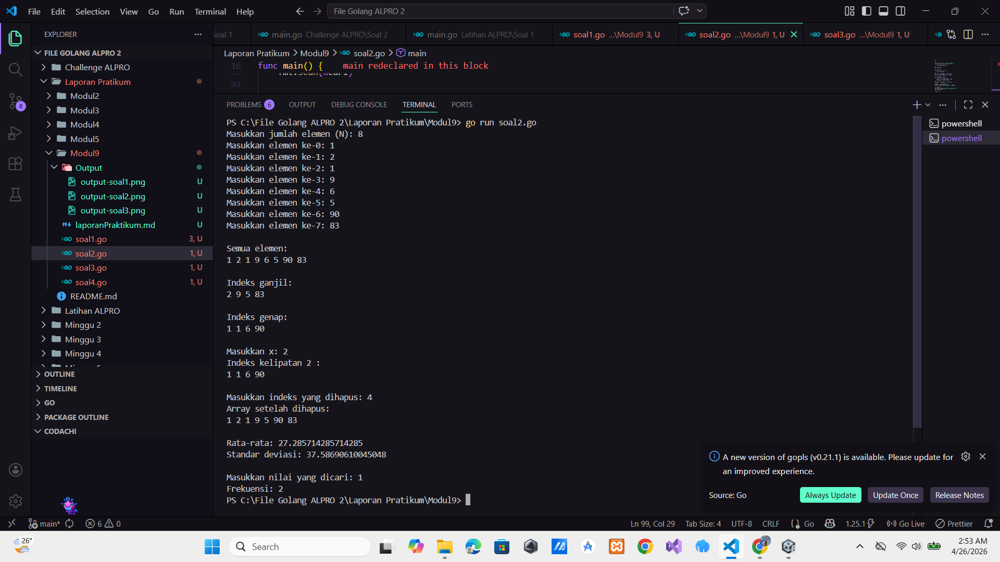
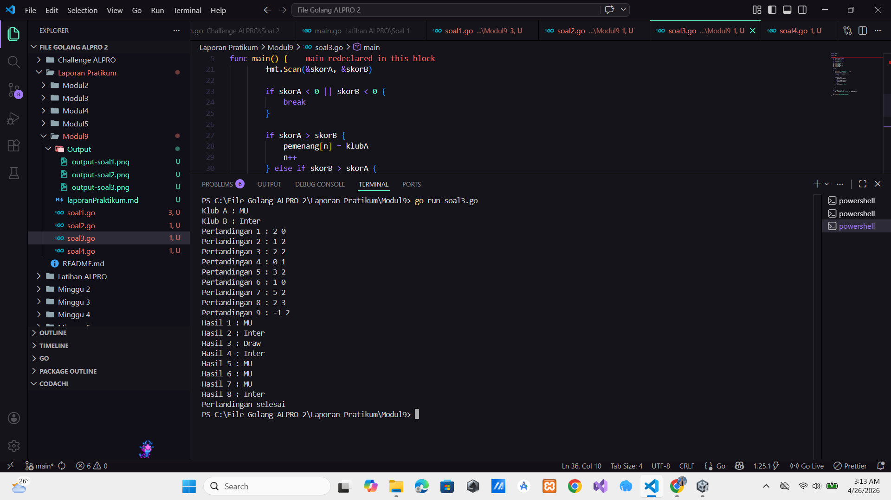
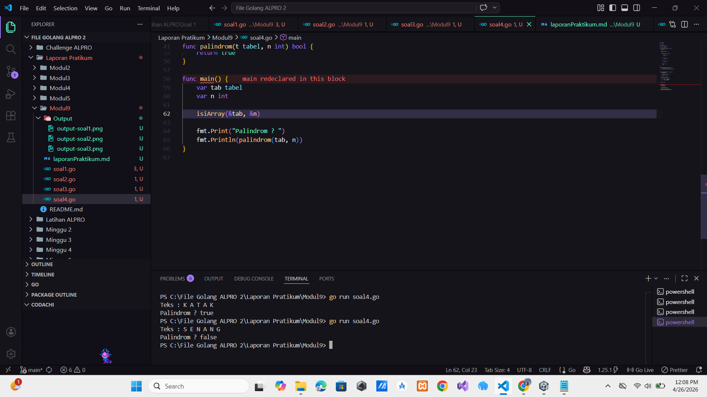
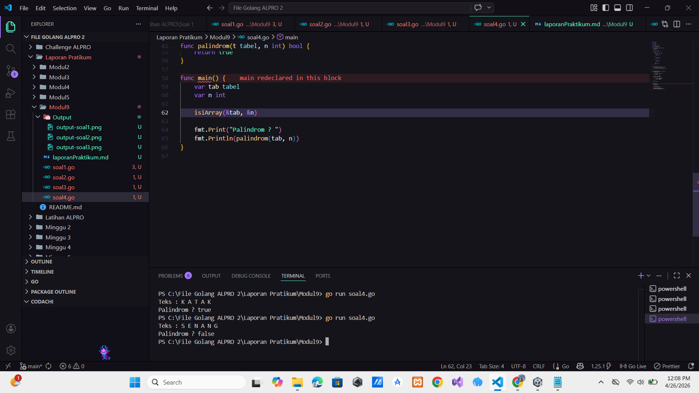

# <h1 align="center">Laporan Praktikum Modul 3 - ... </h1>

<p align="center">Hilkia Farrel Azaria - 109082500205</p>

## Unguided

### 1. [Soal]

#### soal1.go

```go
package main

import "fmt"

type titik struct {
	x int
	y int
}

type lingkaran struct {
	pusat titik
	r     int
}

func jarak(p, q titik) int {
	dx := p.x - q.x
	dy := p.y - q.y
	return dx*dx + dy*dy
}

func didalam(c lingkaran, p titik) bool {
	return jarak(p, c.pusat) < c.r*c.r
}

func main() {
	var c1, c2 lingkaran
	var p titik

	fmt.Scan(&c1.pusat.x, &c1.pusat.y, &c1.r)

	fmt.Scan(&c2.pusat.x, &c2.pusat.y, &c2.r)

	fmt.Scan(&p.x, &p.y)

	in1 := didalam(c1, p)
	in2 := didalam(c2, p)

	if in1 && in2 {
		fmt.Println("Titik di dalam lingkaran 1 dan 2")
	} else if in1 {
		fmt.Println("Titik di dalam lingkaran 1")
	} else if in2 {
		fmt.Println("Titik di dalam lingkaran 2")
	} else {
		fmt.Println("Titik di luar lingkaran 1 dan 2")
	}
}

```

### Output Unguided :

##### Output


[penjelasan]

Program di atas adalah program untuk menentukan posisi sebuah titik terhadap dua buah lingkaran. Yang dimana di awal saya membuat dua tipe data bentukan (struct) yaitu titik yang memiliki atribut x dan y untuk menyimpan koordinat dengan lingkaran yang memiliki atribut pusat (bertipe titik) dan r sebagai jari-jari.Lalu saya membuat fungsi bernama jarak yang memiliki parameter dua titik, yaitu p dan q. Fungsi ini digunakan untuk menghitung jarak kuadrat antara dua titik dengan rumus (dx _ dx + dy _ dy) di mana dx adalah selisih koordinat x dan dy adalah selisih koordinat y. Nilai yang dikembalikan berupa integer.Dan selanjutnya saya membuat fungsi didalam yang bertujuan untuk mengecek apakah sebuah titik berada di dalam lingkaran atau tidak. Fungsi ini menerima parameter sebuah lingkaran dan sebuah titik. Di dalam fungsi ini, dilakukan perbandingan antara jarak kuadrat titik ke pusat lingkaran dengan kuadrat jari-jari lingkaran jika jaraknya lebih kecil maka titik tersebut berada di dalam lingkaran. lalu dimain saya mendeklarasikan dua variabel lingkaran (c1 dan c2) serta satu titik p. Program kemudian membaca input dari pengguna berupa koordinat pusat dan jari-jari untuk kedua lingkaran, serta koordinat titik yang akan dicek. Setelah itu, program memanggil fungsi didalam untuk masing-masing lingkaran dan menyimpan hasilnya ke dalam variabel in1 dan in2. Lalu yang terakhir program menggunakan percabangan if-else untuk menentukan posisi titik.

### 2. [Soal]

#### soal2.go

```go
package main

import "fmt"

func sqrt(x float64) float64 {
	if x == 0 {
		return 0
	}
	z := x
	for i := 0; i < 20; i++ {
		z = z - (z*z-x)/(2*z)
	}
	return z
}

func main() {
	var n int
	fmt.Print("Masukkan jumlah elemen (N): ")
	fmt.Scan(&n)

	var arr [100]int

	for i := 0; i < n; i++ {
		fmt.Printf("Masukkan elemen ke-%d: ", i)
		fmt.Scan(&arr[i])
	}

	fmt.Println("\nSemua elemen:")
	for i := 0; i < n; i++ {
		fmt.Print(arr[i], " ")
	}
	fmt.Println()

	fmt.Println("\nIndeks ganjil:")
	for i := 0; i < n; i++ {
		if i%2 == 1 {
			fmt.Print(arr[i], " ")
		}
	}
	fmt.Println()

	fmt.Println("\nIndeks genap:")
	for i := 0; i < n; i++ {
		if i%2 == 0 {
			fmt.Print(arr[i], " ")
		}
	}
	fmt.Println()

	var x int
	fmt.Print("\nMasukkan x: ")
	fmt.Scan(&x)

	fmt.Println("Indeks kelipatan", x, ":")
	for i := 0; i < n; i++ {
		if i%x == 0 {
			fmt.Print(arr[i], " ")
		}
	}
	fmt.Println()

	var idx int
	fmt.Print("\nMasukkan indeks yang dihapus: ")
	fmt.Scan(&idx)

	for i := idx; i < n-1; i++ {
		arr[i] = arr[i+1]
	}
	n--

	fmt.Println("Array setelah dihapus:")
	for i := 0; i < n; i++ {
		fmt.Print(arr[i], " ")
	}
	fmt.Println()

	var sum int
	for i := 0; i < n; i++ {
		sum += arr[i]
	}
	avg := float64(sum) / float64(n)
	fmt.Println("\nRata-rata:", avg)

	var variance float64
	for i := 0; i < n; i++ {
		diff := float64(arr[i]) - avg
		variance += diff * diff
	}
	variance = variance / float64(n)

	stdDev := sqrt(variance)
	fmt.Println("Standar deviasi:", stdDev)

	var cari int
	fmt.Print("\nMasukkan nilai yang dicari: ")
	fmt.Scan(&cari)

	freq := 0
	for i := 0; i < n; i++ {
		if arr[i] == cari {
			freq++
		}
	}
	fmt.Println("Frekuensi:", freq)
}

```

### Output Unguided :

##### Output


[penjelasan]

Program di atas adalah program yang digunakan untuk mengolah data array bilangan bulat sekaligus menghitung beberapa nilai statistik seperti rata-rata dan standar deviasi. Nah di awal awal saya membuat sebuah fungsi bernama sqrt dengan parameter x bertipe data float64 dan fungsi ini akan mengembalikan nilai float64. Fungsi ini digunakan untuk menghitung akar kuadrat. Jika nilai x == 0, maka fungsi langsung mengembalikan 0. Jika tidak, variabel z diinisialisasi dengan nilai x, lalu dilakukan perulangan sebanyak 20 kali untuk mendapatkan pendekatan akar kuadrat dari x. Kemudian pada fungsi main program pertama-tama meminta input jumlah elemen array (N) dari pengguna lalu program mendeklarasikan array arr dengan kapasitas maksimum 100 elemen. Pengguna diminta untuk mengisi setiap elemen array sesuai dengan jumlah N yang telah dimasukkan. Program menampilkan seluruh isi array. Kemudian program juga menampilkan elemen-elemen berdasarkan indeksnya, yaitu elemen dengan indeks ganjil dan elemen dengan indeks genap. Lalu program meminta sebuah nilai x dari pengguna. Nilai ini digunakan untuk menampilkan elemen array yang berada pada indeks kelipatan x. Program juga menyediakan fitur untuk menghapus elemen array berdasarkan indeks yang dimasukkan oleh pengguna. Setelah elemen dihapus array akan digeser ke kiri dan jumlah elemen (n) akan dikurangi satu. Kemudian array yang sudah diperbarui akan ditampilkan kembali. Kemudian Program menghitung jumlah seluruh elemen array untuk mendapatkan nilai rata-rata (average). Nilai rata-rata dihitung dengan membagi total jumlah elemen dengan banyaknya data. Setelah itu program menghitung varians dengan cara menjumlahkan kuadrat selisih antara setiap elemen dengan rata-rata. Varians kemudian dibagi dengan jumlah data. Untuk mendapatkan standar deviasi, program memanggil fungsi sqrt terhadap nilai varians. Program meminta input nilai yang ingin dicari dalam array. Program kemudian menghitung berapa kali nilai tersebut muncul (frekuensi) di dalam array.

### 3. [Soal]

#### soal3.go

```go
package main

import "fmt"

func main() {
	var klubA, klubB string
	var skorA, skorB int

	var pemenang [100]string
	var n int = 0

	fmt.Print("Klub A : ")
	fmt.Scan(&klubA)
	fmt.Print("Klub B : ")
	fmt.Scan(&klubB)

	j := 1

	for {
		fmt.Printf("Pertandingan %d : ", j)
		fmt.Scan(&skorA, &skorB)

		if skorA < 0 || skorB < 0 {
			break
		}

		if skorA > skorB {
			pemenang[n] = klubA
			n++
		} else if skorB > skorA {
			pemenang[n] = klubB
			n++
		} else {
			pemenang[n] = "Draw"
			n++
		}

		j++
	}

	for i := 0; i < j-1; i++ {
		fmt.Printf("Hasil %d : %v\n", i+1, pemenang[i])

	}
	fmt.Println("Pertandingan selesai")
}


```

### Output Unguided :

##### Output


[penjelasan]

Program di atas adalah program untuk merekap hasil pertandingan dua klub sepak bola dan menyimpan siapa pemenangnya pada setiap pertandingan. Di awal program saya mendeklarasikan beberapa variabel yaitu klubA dan klubB bertipe string untuk menyimpan nama kedua klub yang bertanding. Kemudian ada skorA dan skorB bertipe integer untuk menyimpan skor masing-masing klub pada setiap pertandingan. Lalu saya membuat sebuah array bernama pemenang dengan kapasitas 100 elemen bertipe string, yang digunakan untuk menyimpan hasil pemenang dari setiap pertandingan. Variabel n digunakan sebagai indeks untuk mengisi array tersebut dan diinisialisasi dengan nilai 0. Program kemudian meminta input nama klub A dan klub B dari user menggunakan fmt.Scan. Setelah itu, saya menggunakan perulangan for tanpa kondisi (loop tak hingga) untuk memasukkan skor pertandingan secara berulang. Variabel j digunakan untuk menandai nomor pertandingan yang sedang berlangsung. Di dalam perulangan program meminta input skor untuk kedua klub. Jika salah satu skor yang dimasukkan bernilai negatif, maka perulangan akan dihentikan dengan perintah break, yang menandakan bahwa input pertandingan sudah selesai. Jika skorA lebih besar dari skorB, maka klubA dinyatakan sebagai pemenang dan disimpan ke dalam array pemenang. Sebaliknya jika skorB lebih besar dari skorA, maka klubB yang disimpan sebagai pemenang. Jika kedua skor sama, maka hasilnya adalah "Draw" dan juga disimpan ke dalam array. Setiap hasil pertandingan akan disimpan pada indeks ke-n, lalu nilai n akan bertambah satu agar data berikutnya disimpan di posisi selanjutnya. Dan setelah perulangan selesai program akan menampilkan seluruh hasil pertandingan yang telah disimpan di dalam array pemenang menggunakan perulangan for. Lalu terakhir program menampilkan pesan "Pertandingan selesai" sebagai penanda bahwa seluruh proses telah berakhir.

### 4. [Soal]

#### soal4.go

### 4. Bagian A

```go
package main

import "fmt"

const NMAX int = 127

type tabel [NMAX]rune

func isiArray(t *tabel, n *int) {
	*n = 0
	var ch rune

	for {
		fmt.Scanf("%c", &ch)

		if ch == ' ' || ch == '\n' {
			continue
		}

		if ch == '.' || *n >= NMAX {
			break
		}

		t[*n] = ch
		*n++
	}
}

func cetakArray(t tabel, n int) {
	for i := 0; i < n; i++ {
		fmt.Printf("%c ", t[i])
	}
	fmt.Println()
}

func balikanArray(t *tabel, n int) {
	for i := 0; i < n/2; i++ {
		t[i], t[n-1-i] = t[n-1-i], t[i]
	}
}

func main() {
	var tab tabel
	var m int

	fmt.Print("Teks : ")
	isiArray(&tab, &m)

	fmt.Print("Reverse teks : ")
	balikanArray(&tab, m)
	cetakArray(tab, m)

}

```

### Output Unguided :

##### Output


[penjelasan]

Program di atas adalah program untuk membaca sebuah teks dari input pengguna, kemudian membalik urutan karakter teks tersebut dan menampilkannya kembali. Nah di awal program saya mendefinisikan sebuah konstanta bernama NMAX yang digunakan sebagai batas maksimum jumlah karakter yang bisa disimpan dalam array. Lalu selanjutnya saya membuat tipe data tabel yang merupakan array dengan elemen bertipe rune untuk menyimpan karakter. Lalu kemudian terdapat fungsi isiArray yang berfungsi untuk membaca input karakter satu per satu dari pengguna. Fungsi ini menerima parameter berupa pointer ke array tabel dan pointer ke integer n sebagai penanda jumlah elemen yang terisi. Dan di dalam fungsi ini dilakukan perulangan terus-menerus untuk membaca karakter menggunakan fmt.Scanf("%c", &ch) jika karakter yang dibaca adalah spasi atau garis baru maka akan dilewati dan jika karakter berupa titik (.) atau jumlah elemen sudah mencapai batas maksimum maka proses input akan dihentikan setiap karakter akan disimpan ke dalam array dan nilai n akan bertambah. Lalu terdapat fungsi cetakArray yang digunakan untuk menampilkan isi array ke layar. Fungsi ini akan mencetak setiap karakter dalam array satu per satu sesuai jumlah elemen yang tersimpan. Dan fungsi berikutnya adalah balikanArray yang berfungsi untuk membalik urutan isi array. Proses pembalikan dilakukan dengan cara menukar elemen dari depan dengan elemen dari belakang secara berpasangan hingga mencapai tengah array. Di Main saya mendeklarasikan variabel tab bertipe tabel untuk menyimpan karakter dan variabel m untuk menyimpan jumlah karakter yang diinput. Program kemudian meminta pengguna memasukkan teks lalu fungsi isiArray dipanggil untuk membaca input tersebut Setelah data tersimpan program akan membalik isi array menggunakan fungsi balikanArray dam menampilkan hasilnya dengan fungsi cetakArray.

### 4. Bagian B

```go
package main

import "fmt"

const NMAX int = 127

type tabel [NMAX]rune

func isiArray(t *tabel, n *int) {
	var ch rune
	*n = 0

	fmt.Print("Teks : ")

	for {
		fmt.Scanf("%c", &ch)

		if ch == '\n' {
			break
		}

		if ch == '\r' {
			continue
		}

		if ch == ' ' {
			continue
		}

		t[*n] = ch
		*n++
	}
}

func balikanArray(t *tabel, n int) {
	for i := 0; i < n/2; i++ {
		t[i], t[n-1-i] = t[n-1-i], t[i]
	}
}

func palindrom(t tabel, n int) bool {
	var temp tabel

	for i := 0; i < n; i++ {
		temp[i] = t[i]
	}

	balikanArray(&temp, n)

	for i := 0; i < n; i++ {
		if t[i] != temp[i] {
			return false
		}
	}
	return true
}

func main() {
	var tab tabel
	var n int

	isiArray(&tab, &n)

	fmt.Print("Palindrom ? ")
	fmt.Println(palindrom(tab, n))
}


```

### Output Unguided :

##### Output


[penjelasan]

Program di atas adalah program untuk memeriksa apakah sebuah teks termasuk palindrom atau tidak. Di awal saya membuat sebuah konstanta bernama NMAX yang digunakan sebagai batas maksimum jumlah karakter yang dapat disimpan. Lalu saya mendefinisikan tipe data tabel berupa array dengan elemen bertipe rune untuk menampung karakter Dan terdapat fungsi isiArray yang digunakan untuk membaca input dari pengguna fungsi ini menerima parameter berupa pointer ke array dan pointer ke variabel jumlah elemen. Di dalam fungsi program membaca karakter satu per satu menggunakan fmt.Scanf("%c", &ch). Jika karakter yang dibaca adalah newline (\n), maka proses input akan berhenti. Jika karakter adalah (\r) atau spasi maka akan diabaikan. Setiap karakter selain itu akan disimpan ke dalam array dan jumlah elemen akan bertambah. Kemudian terdapat fungsi balikanArray yang berfungsi untuk membalik urutan isi array. Prosesnya dilakukan dengan menukar elemen dari depan dengan elemen dari belakang hingga mencapai tengah array. Dan berikutnya adalah fungsi palindrom yang digunakan untuk mengecek apakah teks termasuk palindrom fungsi ini bekerja dengan cara menyalin isi array asli ke array sementara. lalu array sementara dibalik menggunakan fungsi balikanArray. Kemudian program membandingkan setiap elemen array asli dengan array yang sudah dibalik. Jika ada perbedaan maka fungsi akan mengembalikan nilai false. Jika semua elemen sama maka fungsi akan mengembalikan nilai true. Pada main saya mendeklarasikan variabel tab untuk menyimpan karakter dan variabel n untuk jumlah elemen. Program kemudian memanggil fungsi isiArray untuk membaca input dari pengguna. Setelah itu program akan mengecek apakah teks tersebut palindrom dengan memanggil fungsi palindrom lalu menampilkan hasilnya menggunakan fmt.Println.
